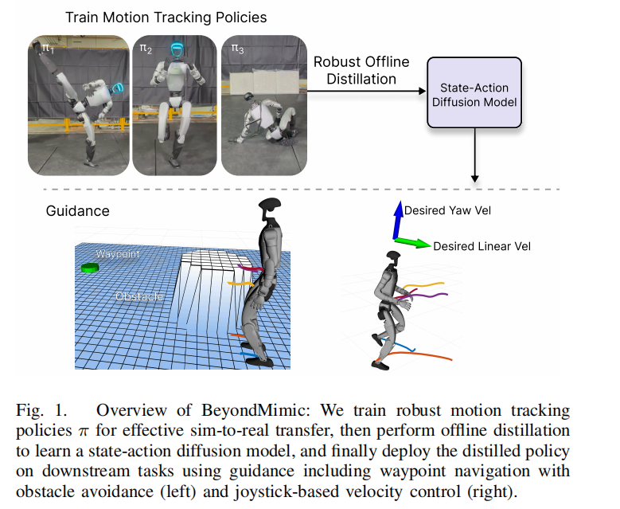

# BeyondMimic: From Motion Tracking to Versatile Humanoid Control via Guided Diffusion

## Basic Information 

1. Date: 2025.8.11

2. Institutions: University of California, Berkeley(UCB), Stanford
 University

3. Journal/Conference: preprint on Arxiv

4. Home Page Link: [https://beyondmimic.github.io/](https://beyondmimic.github.io/)

5. Goal: Reproducing a given reference motion on robot hardware with high quality in global coordinates.

## Inspiration

1. manifold - 用流形来理解动作的学习。模型的训练理解为生成一个流形，每个动作都是这个流形上的一条曲线，动作的切换就在曲线的交汇处。

    - 李群李代数在这里能不能起作用？

## Chanllenges

1. Gap Between Simulation and Real-World

2. Deployment difficulty:

    1) a scalable, high-quality motion tracking framework

    2) an effective sim-to-real recipe to distill learned motion primitives into a single policy

## Solution and Technology

### Framework

1. Motion tracking pipline 

2. Guided diffusion policy

3. Figure

### Technical Points 

1. Reinforcement Learning 

2. Motion Tracking (Scalable Motion Tracking)

    1) unified MDP(Markov Decision Process)

        - MDP - 强化学习中的经典数学模型，用于描述智能体（如机器人）在环境中的决策过程

            MDP 四要素：
        
            (1) 状态 State
        
            (2) 动作 Action 
            
            (3) 状态转移概率 State Transition Probability
            
            (4) 奖励函数 Reward Function 
           

        - Unified MDP - 将所有运动跟踪任务抽象为同一套MDP公式

    2) a single set of hyperparameters

3. Diffusion-based Controller (First Guided Diffusion for Humanoids)

4. End-to-End 

### Dataset

## Scaleable Motion Tracking 

### 1. Tracking Objective

- Anchor - root or torso of humaniod, as a reference part of body 

- coordinate definetion 

- forward kinematics 

- Tracking Traget - subset of whole body 

### 2. Observations

> Formulate the policy observation space as a single-timestep vector comprising three components

1. include thejoint positions and velocities from the motion, $ \mathbf{c}=[\mathbf{q}_{joint,motion}, \mathbf{v}_{joint,motion} ] $ 

2. include the pose tracking error of the reference body(the anchor)

3. include the motion-irrelevant observations 

Complete Observation Space: $ \mathbf{o} = [ \mathbf{c}, \xi_{b_{ref}}, ^{b_{root}}\mathcal{V}, \mathbf{q}_{joint}, \mathbf{v}_{joint}, \mathbf{a}_{last} ] $

### 3. Joint Impedance and Actions 

1. high joint impedance (Many order works in character animation)

    - good: (1)precise tracking; (2)reducing the control problem in free-space to a nearly kinematics problem.

    - bad: (1)impractical for hardware deployment; (2)hinder implicit torque information from current and prior commands

2. solution in this paper 

    - joint impedance(sitffness and damping), following Raibert 

    - normalized joint position setpoints

### 4. Rewards 

design the rewards in a simple, intuitive, and general way 

consisting of:

1. Task rewards 
    
    - positive 

    - uniformly weighted 

    - expressed in task space

2. Minimal regularization penalties 

    - to avoid hurting tracking performance 

### 5. Termination and Reset

termination condition:

1. fall

2. tracking Failure

when reset:

1. sample motion phase frome entire reference trajectory adaptively 

### 6. Adaptive Sampling

necessity:

- not all segments are equally difficult

disadvantage of uniform sampling:

- easy segments are oversampled 

- hard segments are undersampled

### 7. Domain Randomization 

necessity:

- increasing the robust of algorithm 

apply three domain randominzation terms:

1. the ground friciton coefficient 

2. default joint positions

3. the torso's centre of mass position 

## Trajectory Synthesis via Guided Defussion

### 1. Training

1. employ Diffuse-CLoC to create a state-action co-difussion framework

2. standard denoising diffusion process

3. minimizing the MSE(Mean Squared Error) 

### 2. Guidance

> 重点关注这一节里面的数学原理

goal:

- to direct the model toward specific objectvies during inference, drives the sampling process toward lower-cost regions of the trajectory space

method:

1. classifer guidance

2. Bayes' theorem 

3. cost function 

three representative task to demonstrate highly versatility of the framework, each defined by different types of trajectory constraints:

1. joystick steering

2. waypoint navigation 

3. obstacle avoidance

### 3. Downstream Tasks

#### (1) joystick steering 

cost function: 
$$ G_{\tau}^{c}(\tau) = \frac{1}{2} \sum_{t'=t}^{t+H} \left\| V_{xy,t'}(\tau_{t'}) - g_{v} \right\|^{2} 
$$ 
1. squared difference between the state prediction velocity and the joystick input velocity 

#### (2) waypoint navigation 

representative: 

$$ 
G_{\boldsymbol{\tau}}^{\mathrm{ts}}(\boldsymbol{\tau}) = \sum_{t^{\prime}=t}^{t+H} \left(1 - e^{-2d}\right) \left\| P_{x}(\boldsymbol{s}_{t^{\prime}}) - g_{p} \right\|^{2} + e^{-2d} \left\| V_{x, t^{\prime}}(\boldsymbol{\tau}_{t^{\prime}}) \right\|^{2} 
$$

1. cost function rewards proximity to the target

2. increasingly penalizing velocity as the agent gets closer (接近目标点时，对速度的惩罚增加，速度越大，惩罚越大，以达到停止运动的目的)

#### (3) obstacle avoidance

build a Signed Distance Field(SDF, 带符号的距离场) to obtain the distance and gradient between body positions and the nearest object

cost function:

$$ 
G_{\boldsymbol{\tau}}^{c}(\boldsymbol{\tau}) = \sum_{t^{\prime}=t}^{t+H} \sum_{b \in \mathcal{B}_{\mathrm{c}}} B\left( \operatorname{SDF}\left( \mathbf{P}_{b, t^{\prime}}(\boldsymbol{\tau}) \right) - r_i, \delta \right) 
$$

## Ecperiments and Resutls

## Discussion and Future Work

### 猛猛夸自己的成果

### 待解决的问题

state estimation drift - 状态预测偏移

## Words

overfit - 过拟合

domain randomization - 邻域随机化

kinematic diffusion model - 运动学扩散模型
N
out-of-distribution 

infrequent - 低频的，罕见的，不频发的

frequent - 高频的，频繁的

torso - 躯干

designate - to say officially that sth has a particular character or name; to describe sth in a particular way

Twist - 速度旋量，描述刚体运动的速度信息，包含线速度和角速度分量

joint impedance - 关节阻抗，指机器人关节对外力或运动变化的响应特性，包含刚度（Stiffness）、阻尼（Damping）和惯性（Inertia）参数。通过调节阻抗值，可控制关节的柔顺性（例如高阻抗用于精确跟踪，低阻抗用于安全交互）。

first two columns of the rotation error matrix - 旋转误差矩阵的前两列

passive compliance - 被动柔顺性

impact absorption - 冲击吸收

stiffness and damping - 刚度和阻尼

Reflected Inertia - 反射惯量，器人动力学中的一个关键概念，特指在电机端（或驱动侧）观测到的、经过传动机构（如齿轮箱、减速器）放大后的负载惯量。（减速机的减速比导致负载惯量减少，输出扭矩增大）

motor armature - 电机的电枢

heuristic - 启发，teaching or education encourages you to learn by discovering things for yourself

uniformly weighted - 均匀加权；指在优化目标、损失函数或评估指标中，对所有组件或误差项赋予相同的权重，而非根据重要性差异化处理。

perturbation - 扰动，a small change in the quality, behaviour or movement of sth

physically-grounded - 物理可行的，指算法生成的结果（如机器人动作、运动轨迹）符合物理世界的规律和约束

Bayes' theorem - 贝叶斯定理，条件概率：$ P(A|B) = \cfrac{P(B|A)P(A)}{P(B)} $

conditional distribution - 条件分布

unconditional score - 无条件分数

decompose - 分解，解构

conditional likelihood - 条件似然

proximity - n.（时间、空间、关系的）靠近，亲近

inert - adj. 惰性的，迟缓的 without power to move or act,without active chemical or other properties

gantry - 龙门架

erratic - adj. 不稳定的，难以预测的 unpredictable; not happening at regular times; not following any plan or regular pattern; that you cannot rely on

erratic or unstable behavior - 难以预测和不稳定的行为

transitioning between distinct skills - 在不同的技能之间过渡/转移（扩散模型逐帧生成，缺乏时序性）

conceptualize - v. 构思；使形成观念；将…概念化（为…）to form an idea of sth in your mind 

manifold - 流形

