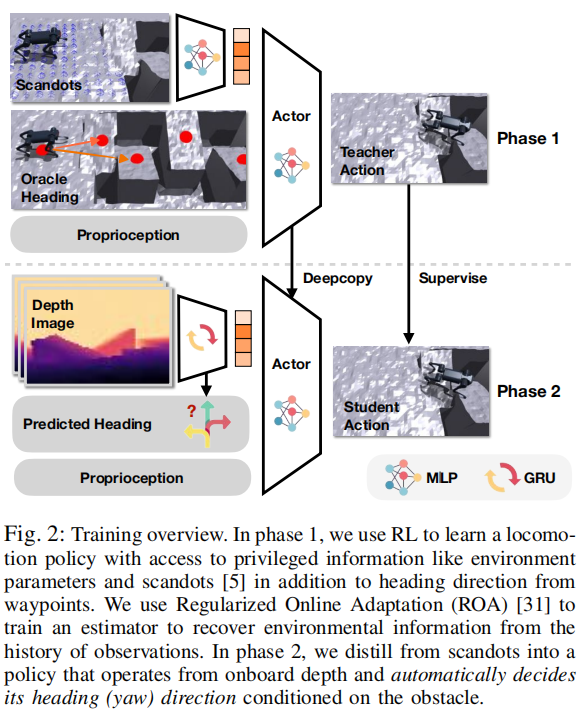
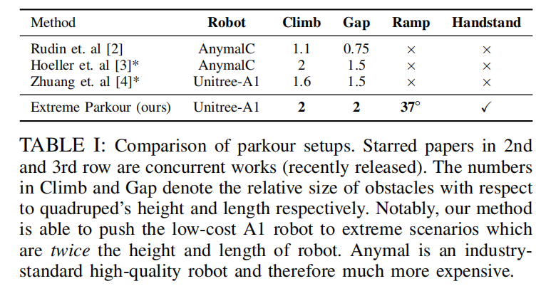

# Extreme Parkour with Legged Robots 

Institutions: CMU(Carnegie Mellon University)，UZH(University of Zurich)

Journal/Conference: ICRA 2024 (2024 IEEE International Conference on Robotics and Automation)

Hardware: Unitree A1, >= 10k USD, >= 80K RMB; low-cost? 

Computing resources: RTX 3090 (may be? get it from these github readme)

## 震撼

1. 这个领域发展太快了，2024年见刊的论文，看起来已经非常陈旧了，太卷了太卷了

## 特点 

1. 端到端（End-to-End），end-to-ednd data-driven reinforement learning framework

2. 用的是“低成本机器人”（不精确的执行器和传感器）

3. 感知仅用一个 "front-facing" 的深度相机

4. 只用一个神经网络（single neural net policy） 

## 技术点

1. End-to-End Date-driven RL framework

    input: pixels (depth camera, raw depth and onboard sensing)

    output: motor commands (joint angle commands)

2. Universal Reward Design Principle Based on Inner-products(点积/点乘)

    > III. METHOD ->  A. Unified Reward for Extreme Parkour
    1) Direction 

        $$ 
        \hat{\mathbf{d}}_w = 
        \cfrac{\mathbf{p} - \mathbf{x}}
        {\| \mathbf{p} - \mathbf{x} \|} 
        $$

    2) Velocity Tracking Reward 

        $$
        r_{tracking} = \min( \left<  \mathbf{v}, \mathbf{\hat{d}}_w \right>, v_{cmd})
        $$

    3) Penalize foot contacts near terrain edges

        $$
            r_{clearance} = - \sum_{i=0}^{4} c_i \cdot M[p_i] 
        $$

    4) Track the desired forward vector (stylized, handstand)

        $$
        r_{stylized} = W \cdot [0.5 \cdot \langle \hat{\mathbf{v}_{fwd}}, \hat{\mathbf{c}} \rangle + 0.5 ] ^ 2
        $$

3. Dual Distillation method

    1) Phase 1 : trained with privileged heading
        
        > III. METHOD -> B. Reinforcement Learning from Scandots (Phase 1)

        - input: 

            > (1) proprioception: $ \mathbf{x} $
            > 
            > (2) scandots: $ \mathbf{m} $
            > 
            > (3) target heading: $ \mathbf{\hat{d}} $
            > 
            > (4) walking flag: $ W $ 
            > 
            > (5) commanded speed: $ v_{cmd} $
        
        - Use regularized online adaptation (ROA)to train an adaptation module toestimate environment properties.

        - increasing difficulty 

    2) Phase 2 : distilled to predict its own heading direction

        > III. METHOD -> C. Distilling Direction and Exteroception (Phase 2)

        - From simulation to real robots

            1. scandots -> depth camera

            2. specify waypoints and target directions -> (x) unavailable

4. ROA - Regularized Online Adaptation 

- Training Overview

    

## Benchmark

1. compare with other works

    

## Challenges and Solutions 

1. "low cost Unitree A1 Quadrupedal Robot"

    1) imprecise acuation 

        noisy and laggy action - "Even if the actuions were correct, executing them on laggy and noisy actuators will lead to catastrophic failure." 

    2) imprecise sensing 

        has artifacts, latency and jitter

2. "Since parkour requires diverse behaviors to traverse different obstacles it is challenging to engineer reward functions specific to each"

    1) present a simple, unified reward formulation from which diverse behaviors emerge automatically

3. "during parkour the robot needs to be able to choose its own direction as opposed to following human-specific ones"

    1) Phase 1 - using suitably placed waypoints to provide directions 

    2) Phase 2 - train a network to predict these oracle heading directions from **depth information** 

## Comparsion 

1. Jumping over a wide gap 
    
    1) 之前的方法（classical approaches）。如果想要跨越很宽的沟槽，需要提前精确测量这个沟槽的参数信息，然后求出一个最优动作。但如果障碍的路线或者跑酷（parkour）的路线变了的话，这些方法就不可行了（not feasible）

    2) 使用类似人类学习 parkour 的方法。从实例中学习。不同的人类使用同样不精确的传感器和不精确的执行器，从不断的试错中来学习跑酷。**（对这一点保持怀疑）**

    3) 总结，之前的方法泛化性不够好

## 问题（关于 Benchmark, standard 等）

1. 论文强调用 "imprecise actuation" 去执行 "precise athletic behaviors"，这里涉及到关于 `precise` 的定义的问题，什么样的执行器是精确的，什么样的运动又是精确的。

2. 论文强调机器人能跳过 `2倍` 于自身长度或高度的障碍物，这个是机动性能的问题还是控制能力的问题？文中含糊不清。

## Words 

torque - 扭矩，转矩，T

razor thin - 极小的，刀片般薄的

manoeuvre - a **movement** performed with care and skill

amazing feats - 令人惊叹的动作

in-the-wild setting - 在真实自然环境中

line of words - 系列工作

throw off -  干扰

conceptual challenge - 概念上的挑战

agile - adj. able to move quickly and easily 

inner-product - 内积/点积

paradigm - 范式，范例，样式

privileged heading - 特权航向信息/上帝视角航向信息

privileged visual information - 特权视觉信息/上帝视角视觉信息

privileged - 表示这种信息在训练时可用，但在实际测试或部署时不可用，可以理解为上帝视角tilted ramps - 倾斜的斜坡

penalize - 使受惩罚，v. to punish sb for breaking a rule or law by making them suffer a disadvantage

defining feature - 决定性特征

aesthetically pleasing - 美观的，赏心悦目的

proprioception - 本体感受器

dead pixels - 坏点，指不正常的像素

artifacts, latency and jitter - 失真，延迟和抖动

emergent results, emergent behaviors - 指研究中意外出现的、非预设的实验结果或行为。此处特指通过简单奖励函数训练后，机器人自发产生的、超越研究者预期或传统规则定义的行为模式。

propel - v. to move, drive or push sth forward or in a particular direction推动；驱动；推进

Mean X-Displacement (MXD) - X轴方向上的平均位移
    
    (1) 在足式机器人（如四足机器狗）运动中，MXD用于衡量机器人向前行进（X方向）的平均稳定性或效率。

    (2) 例如：在跨越障碍物时，若机器人频繁左右晃动或后退，其MXD值会较低；若持续稳定前进，则MXD值较高​

Mean Edge Violation (MEV) - 平均边缘违反

    (1) 指机器人在运动过程中超出允许边界的行为​（如越出指定路径边界、触碰禁止区域或偏离安全范围）。

    (2) 例如：足式机器人在狭窄通道行走时，若脚部踩到边界外（如踩空或碰撞障碍物），即发生一次"边缘违反"。

