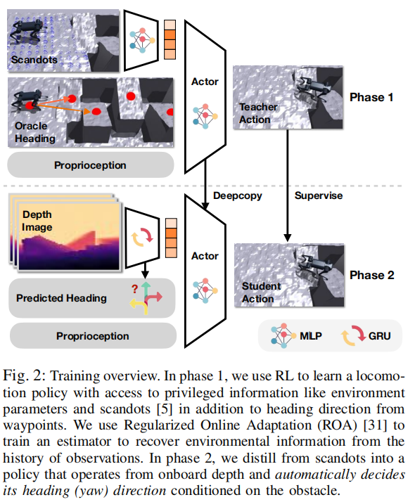
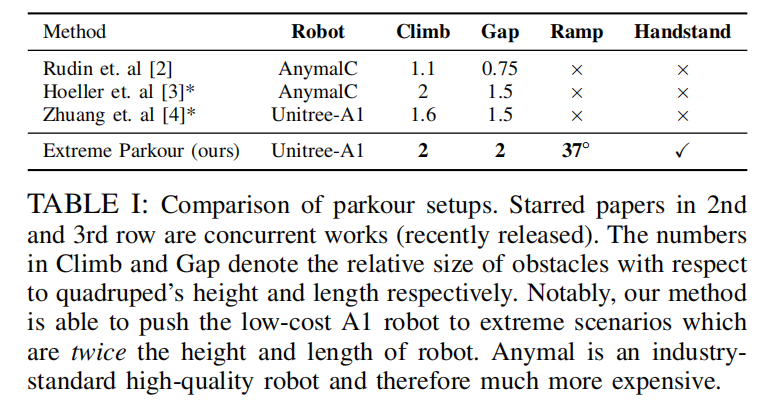

# Extreme Parkour with Legged Robots 

Institutions: CMU(Carnegie Mellon University)，UZH(University of Zurich)

Journal/Conference: ICRA(IEEE International Conference on Robotics and Automation)

Hardware: Unitree A1, >= 10k USD, >= 80K RMB; low-cost? 

Computing resources: RTX 3090 (may be? get it from these github readme)

## 震撼

1. 这个领域发展太快了，2024年见刊的论文，看起来已经非常陈旧了，太卷了太卷了

## 特点 

1. 端到端（End-to-End），end-to-ednd data-driven reinforement learning framework

2. 用的是“低成本机器人”（不精确的执行器和传感器）

3. 感知仅用一个 "front-facing" 的深度相机

4. 只用一个神经网络（single neural net policy） 

## 技术点

### 1. End-to-End

1. End-to-End Date-driven RL framework

    input: pixels (depth camera)

    output: motor commands

2. Dual Distillation method

    Phase 1 : trained with privileged heading

    Phase 2 : distilled to predict its own heading direction 

    

3. Universal Reward Design Principle Based on Inner-products(点积/点乘)

## Benchmark

1. compare with other works

    

## Challenges

1. "low cost Unitree A1 Quadrupedal Robot"

    1) imprecise acuation 

        noisy and laggy action - "Even if the actuions were correct, executing them on laggy and noisy actuators will lead to catastrophic failure." 

    2) imprecise sensing 

        has artifacts, latency and jitter

## Comparsion 

1. Jumping over a wide gap 
    
    1) 之前的方法（classical approaches）。如果想要跨越很宽的沟槽，需要提前精确测量这个沟槽的参数信息，然后求出一个最优动作。但如果障碍的路线或者跑酷（parkour）的路线变了的话，这些方法就不可行了（not feasible）

    2) 使用类似人类学习 parkour 的方法。从实例中学习。不同的人类使用同样不精确的传感器和不精确的执行器，从不断的试错中来学习跑酷。**（对这一点保持怀疑）**

    3) 总结，之前的方法泛化性不够好

## 问题（关于 Benchmark, standard 等）

1. 论文强调用 "imprecise actuation" 去执行 "precise athletic behaviors"，这里涉及到关于 `precise` 的定义的问题，什么样的执行器是精确的，什么样的运动又是精确的。

2. 论文强调机器人能跳过 `2倍` 于自身长度或高度的障碍物，这个是机动性能的问题还是控制能力的问题？文中含糊不清。

## Words 

torque - 扭矩，转矩，T

razor thin - 极小的，刀片般薄的

manoeuvre - a **movement** performed with care and skill

amazing feats - 令人惊叹的动作

in-the-wild setting - 在真实自然环境中

line of words - 系列工作

throw off -  干扰

conceptual challenge - 概念上的挑战

agile - adj. able to move quickly and easily 

inner-product - 内积/点积

paradigm - 范式，范例，样式

privileged heading - 特权航向信息/上帝视角航向信息

privileged visual information - 特权视觉信息/上帝视角视觉信息

privileged - 表示这种信息在训练时可用，但在实际测试或部署时不可用，可以理解为上帝视角tilted ramps - 倾斜的斜坡

